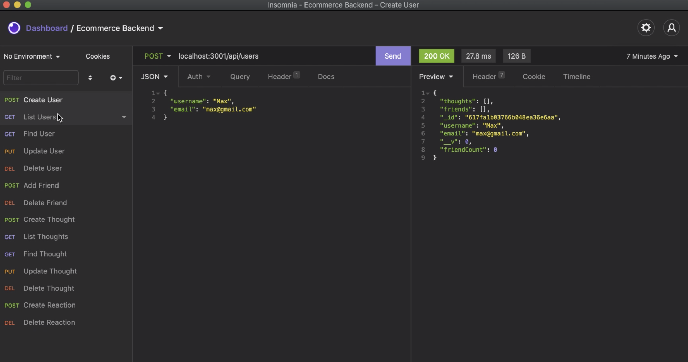

# social-network-api
social network api uses express and mongo to set up an api for a social network.

## Table of Contents
* [Installation](#installation)
* [License](#license)
* [Built With](#built-with)
* [Walkthrough](#walkthrough-video)
* [Questions](#questions)
* [Credits](#credits)

## Installation
Install necessary dependencies before use. Run "npm start" in the root folder, then switch to insomnia to test api routes.

## License
This application uses the MIT license.

## Built With
* NPM
* Express
* Mongoose
* MongoDB

## Walkthrough Video

## Questions
Feel free to contact regarding any questions you may have. 
Github: https://github.com/wamackie 
Email: wamackie8456@gmail.com

## Credits
social network api was created by William Mackie